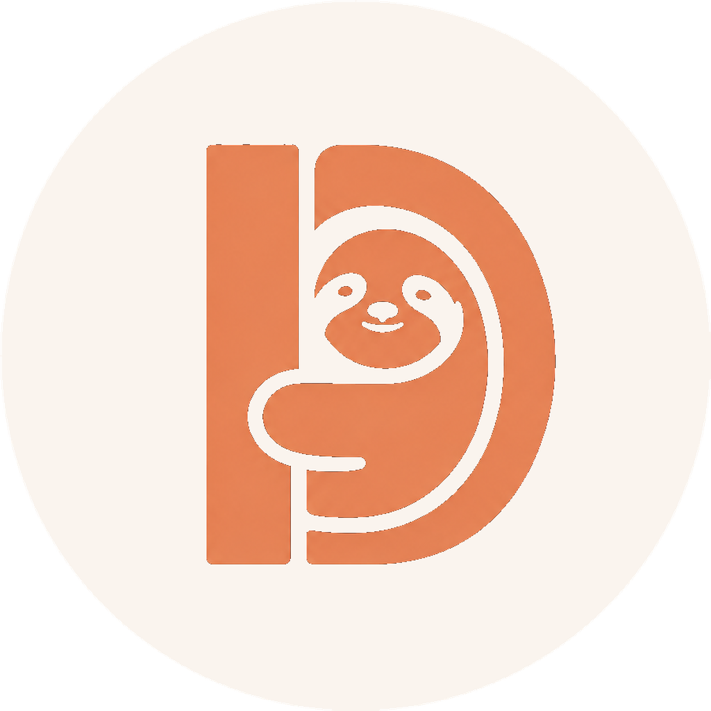

<div align="center">

# Witdem

**See how your AI application ran, what it cost, where it failed, and whether it achieved its product goal.**

Witdem turns OpenTelemetry traces into a local analytics dashboard for agents, graphs, tools, models, workflows, evaluations, and business outcomes.

[Get started](#run-witdem) · [Connect an application](#connect-an-application) · [Run the example matrix](#run-the-product-factory-example) · [Documentation](#documentation)

</div>

## See parallel and asynchronous execution

Witdem preserves observed concurrency in workflow replays. When sibling operations overlap in the trace, the dashboard renders the real fan-out and fan-in instead of flattening them into a misleading sequence:

```text
             ┌→ semantic retriever ─┐
execution ───┤                       ├→ answer
             └→ keyword retriever ──┘
```

This is based on recorded span relationships and timestamps—not an assumed static diagram. Each branch keeps its own duration, status, model/tool activity, tokens, and measured cost. The next observed stage is shown after the concurrent branch group finishes.

This works with asynchronous framework execution, including Haystack `AsyncPipeline`. See the [runnable Haystack + OpenAI example](examples/haystack/pipeline/README.md), which starts two retrievers concurrently and joins their evidence before producing an answer.

## Run Witdem

### Docker — recommended

You need Docker with Compose. Clone the repository and start the stack:

```bash
git clone https://github.com/ebrahimisoheil/witdem-oss.git Witdem-Analytics
cd Witdem-Analytics
docker compose up -d
```

Open **http://localhost:8501**.

The stack starts three services:

| Service | Address | Purpose |
| --- | --- | --- |
| Dashboard | `http://localhost:8501` | Explore runs, workflows, issues, comparisons, and replay graphs |
| Receiver | `http://localhost:4318` | Accept OpenTelemetry and Witdem SDK telemetry |
| ELT worker | internal | Transform the durable corpus into dashboard-ready analytics |

Confirm that everything is running:

```bash
docker compose ps
curl http://localhost:4318/readiness
curl http://localhost:8501/health
```

Stop Witdem without deleting its data:

```bash
docker compose down
```

### Python

Witdem requires Python 3.10 or newer. DuckDB and Duckle are installed automatically.

```bash
pip install witdem-analytics
witdem dev
```

Then open **http://localhost:8501**. The receiver listens on **http://localhost:4318**.

To run the current checkout instead of the published package:

```bash
git clone https://github.com/ebrahimisoheil/witdem-oss.git Witdem-Analytics
cd Witdem-Analytics
uv sync
uv run witdem dev
```

## Connect an application

### Standard OpenTelemetry

An application that already emits OpenTelemetry needs no Witdem dependency. Point its OTLP/HTTP exporter at the receiver:

```bash
export OTEL_SERVICE_NAME=my-agent
export OTEL_EXPORTER_OTLP_ENDPOINT=http://localhost:4318
export OTEL_EXPORTER_OTLP_PROTOCOL=http/protobuf
```

Run the application normally. Its executions will appear in the dashboard.

### Witdem SDK

Use the SDK when you also want application outcomes, evaluations, decisions, metrics, and product goals. Install the extra for your framework:

```bash
pip install "witdem-sdk[langgraph]"
```

Describe the application result in `.witdem/witdem.yaml`:

```yaml
version: 1
service:
  name: research-agent
  runtime: langgraph
telemetry:
  capture_content: false
contracts:
  - name: research-report
    application_outcome:
      status: $.editorial_decision
    artifact:
      name: Research report
      valid:
        non_empty: $.report
    decision:
      name: Editorial approval
      expected: approved
      observed: $.editorial_decision
    product_goal:
      name: Approved research report
      achieved: $.approved
      closest_blocker: $.blocker
```

Wrap the compiled graph at the point where it is returned:

```python
from witdem_sdk.integrations.langgraph import instrument

return instrument(graph.compile())
```

That is the entire code integration. Existing `invoke`, `ainvoke`, `stream`, and `astream` calls stay unchanged. The SDK owns setup, correlation, framework callbacks, error recording, contract evaluation, flushing, and cleanup.

The same `instrument(...)` boundary is available for OpenAI Agents, Anthropic, LangChain, Haystack, Claude Agent SDK, and provider calls without a native adapter.

## Run the Product Factory example

Product Factory runs the same qualification workload across LangChain, LangGraph, Haystack, OpenAI Agents, and Anthropic Messages.

```bash
cd examples/product-factory
cp .env.example ../.env
```

Add the provider keys requested in `examples/.env`, then run one live case:

```bash
uv sync --all-extras
uv run product-factory run \
  --case clear-qualification \
  --runtime langgraph \
  --live \
  --confirm-live
```

Run the complete 44-cell live matrix:

```bash
uv run product-factory matrix \
  --suite all \
  --live \
  --confirm-live
```

Live runs use paid provider APIs. The command requires explicit confirmation and writes a reproducible report under `examples/product-factory/reports/`.

## Built with

<table>
  <tr>
    <td align="center" width="33%">
      <br>
      Durable local analytics storage
    </td>
    <td align="center" width="33%">
      <br>
      Raw-to-serving transformation
    </td>
    <td align="center" width="33%">
      <br>
      Dashboard routing, queries, and tables
    </td>
  </tr>
</table>

Witdem is an independent project. DuckDB is a trademark of the DuckDB Foundation. Use of these project names and unmodified marks describes the technologies used by Witdem and does not imply endorsement.

## Useful commands

```bash
witdem doctor       # verify the local installation
witdem inspect      # inspect current corpus state
witdem elt status   # check transformation progress
witdem elt rebuild  # rebuild analytics from the durable corpus
```

## Documentation

- [SDK and framework integrations](docs/sdk.md)
- [Examples](docs/examples.md)
- [Dashboard semantics](docs/dashboard.md)
- [Architecture and data flow](docs/architecture.md)
- [Operations and deployment](docs/operations.md)
- [Development](docs/development.md)
- [Release notes](docs/changelog.md)

Version compatibility is machine-readable in [`compatibility.json`](compatibility.json).
