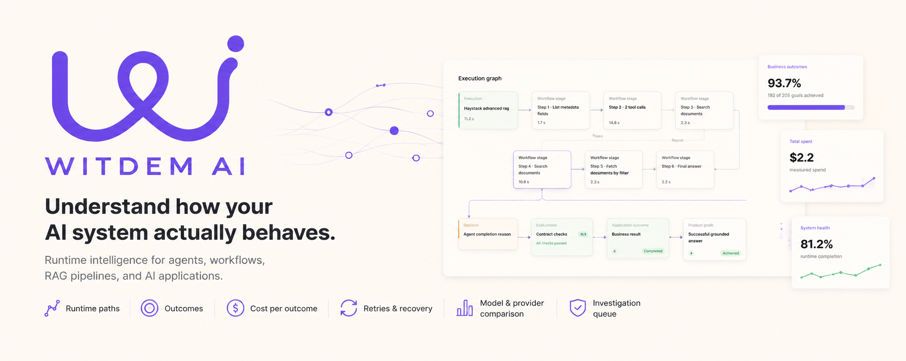

<div align="center">



# Witdem

**Analytics for AI agents and multi-step AI applications.**

Tracing tells you what executed. Witdem connects those executions to application outcomes: which paths ran, what they cost, where they failed, and whether they achieved the product goal you defined.

[](https://github.com/ebrahimisoheil/witdem-oss/actions/workflows/test.yml)
[](https://pypi.org/project/witdem-sdk/)
[](https://pypi.org/project/witdem-analytics/)
[](https://www.npmjs.com/package/witdem)
[](https://github.com/ebrahimisoheil/witdem-oss/actions/workflows/test.yml)
[](LICENSE)

[Get started](docs/getting-started.md) · [YAML contracts](docs/contract-tutorial.md) · [Frameworks](#integration-status) · [Providers](docs/providers.md) · [Contributing](CONTRIBUTING.md) · [Security](SECURITY.md)

</div>

## First run

Start the local receiver, ELT worker, and dashboard:

```bash
npx -y witdem@0.2.0 up
```

That pulls the version-matched container, starts all three services, waits for
them to become healthy, and opens `http://localhost:8501`. Docker with Compose
is the only prerequisite. Data persists across `down` and package upgrades.

```bash
npx -y witdem@0.2.0 status
npx -y witdem@0.2.0 logs
npx -y witdem@0.2.0 down
```

Add the SDK to an existing Haystack 3 project:

```bash
python -m pip install "witdem-sdk[haystack]==0.2.0"
export WITDEM_ENDPOINT=http://localhost:4318
```

From the application project, create the YAML contract and then edit it to
describe that application's result:

```bash
witdem init --runtime haystack
```

This creates `.witdem/witdem.yaml`. It does not inspect or rewrite application
code, and it will not replace an existing contract unless `--force` is used.

Wrap the pipeline once. Its existing `run`, `run_async`, and `run_async_generator` calls stay unchanged:

```python
from witdem_sdk.integrations.haystack import instrument

pipeline = instrument(build_pipeline())
result = pipeline.run(data)
```

Add `.witdem/witdem.yaml` to describe what a useful result means:

```yaml
version: 1
service:
  name: support-agent
  runtime: haystack
telemetry:
  capture_content: false
contracts:
  - name: answer
    mode: expression
    artifact:
      name: Support answer
      valid:
        non_empty: $.answer
    decision:
      name: Result validity
      expected: true
      observed: $.witdem.artifact_valid
    product_goal:
      name: Useful answer returned
      achieved: $.witdem.artifact_valid
```

Run the application normally. The execution and its business result appear at **http://localhost:8501**.

## What you get

- Actual execution paths, branches, loops, retries, tools, model calls, and failures
- Per-run latency, token usage, and cost when provider/model/usage evidence is sufficient
- Application outcomes and product-goal success defined by your application
- Provider and model comparisons using attributable time, usage, cost, and quality
- Workflow/path analytics and run-linked issue investigation
- Local DuckDB storage and a self-hosted dashboard; prompt and response capture is off by default

Witdem does not infer business success from a completed LLM call. Framework instrumentation records what happened technically; `.witdem/witdem.yaml` explains what the final result means.

## Integration status

Statuses reflect current implementation and test evidence, not roadmap intent.

| Integration | Status | Verified surface |
| --- | --- | --- |
| [Haystack 3](docs/integrations/haystack.md) | **Stable** | Pipelines, agents, components, provider calls, loops, parallel branches, `run`, `run_async`, async generators |
| [LangGraph](docs/integrations/langgraph.md) | **Beta** | Compiled graphs, nodes, tools, models, errors, sync/async invocation and streaming |
| [LangChain](docs/integrations/langchain.md) | **Beta** | Runnables, chains, chat/LLM calls, tools, retrievers, sync/async invocation and streaming |
| [Native Python](docs/integrations/native-python.md) | **Supported** | Execution, operation, model, tool, decision, evaluation, outcome, and metric primitives |
| [OpenAI Agents](docs/integrations/openai-agents.md) | **Beta** | Native trace processor, agents, generations, tools, handoffs, sync/async workloads |
| [Anthropic Messages and Claude Agent SDK](docs/integrations/anthropic.md) | **Beta** | Messages calls, usage, tool-use IDs, multi-turn workloads, Claude Agent message streams |
| [Hugging Face smolagents](docs/integrations/smolagents.md) | **Beta** | Official OpenInference agent, step, model, and tool spans; sync and streaming execution |
| [LiteLLM](docs/integrations/litellm.md) | **Beta** | SDK callback and proxy OTLP paths, provider/model usage, reported cost, failures, routing metadata |
| [OpenRouter](docs/providers/openrouter.md) | **Beta** | OpenAI-compatible sync/async and streaming calls, selected provider, route attempts, authoritative cost |
| Generic provider calls | **Experimental** | Sync/async callable wrapper with explicit provider/model and observed result metadata |
| Standard OTLP/HTTP | **Supported** | Generic OpenTelemetry, OTel GenAI, and OpenInference evidence |

See [`compatibility.json`](compatibility.json) for machine-readable version constraints and [Providers](docs/providers.md) for the difference between native, framework-observed, and generic support.

## Providers

Witdem currently has verified paths for:

- [OpenAI](docs/providers/openai.md) and [Azure OpenAI](docs/providers/azure-openai.md)
- [Anthropic](docs/providers/anthropic.md), including Claude Agent SDK telemetry
- [DeepSeek](docs/providers/deepseek.md)
- [Mistral](docs/providers/mistral.md)
- [Amazon Bedrock](docs/providers/bedrock.md)
- [Google Vertex AI](docs/providers/vertex-ai.md)
- [Ollama](docs/providers/ollama.md)
- [Cohere](docs/providers/cohere.md) (structurally tested, not live-validated)
- [OpenRouter](docs/providers/openrouter.md), including selected upstream provider and fallback metadata
- Hugging Face inference through [smolagents](docs/integrations/smolagents.md) or [LiteLLM](docs/integrations/litellm.md)

OpenAI and Anthropic have dedicated SDK integrations. Haystack observes the generator actually used at each model boundary. The remaining provider examples use standard GenAI OpenTelemetry attributes or `witdem_sdk.integrations.generic`; this is explicit in every provider guide.

Cost is not assumed from a provider name. Witdem uses provider-reported money when present, or the versioned server catalog when provider, model, and token usage match a catalog entry. Unknown prices remain **Not measured** with a diagnostic reason.

## Parallel and asynchronous execution

When sibling spans overlap, Witdem preserves the observed fan-out and fan-in rather than flattening them into a false sequence:

```text
             ┌─ semantic retriever ─┐
execution ───┤                      ├─ answer
             └─ keyword retriever ──┘
```

The runnable [Haystack parallel pipeline](examples/haystack/pipeline/README.md) demonstrates this with two concurrent retrievers and an OpenAI answer component.

## Self-hosting

The npm launcher is the recommended local backend path. It is deliberately a
small, dependency-free Docker launcher rather than a second implementation of
Witdem. It never runs an npm `postinstall` script.

| Service | Address | Purpose |
| --- | --- | --- |
| Dashboard | `http://localhost:8501` | Overview, runs, compare, workflows, and issues |
| Receiver | `http://localhost:4318` | OTLP/HTTP and SDK record ingestion |
| ELT worker | internal | Duckle transformation into dashboard-ready DuckDB tables |

```bash
npx -y witdem@0.2.0 status
curl http://localhost:4318/readiness
curl http://localhost:8501/health
```

For source development, clone the repository and run `docker compose up -d`.
See [Running Witdem with npx](docs/npm-launcher.md) for ports, lifecycle, image
pinning, and troubleshooting.

The Python-only development path is also available:

```bash
uv sync
uv run witdem dev --open
```

## Documentation

- [Getting started](docs/getting-started.md)
- [Running Witdem with npx](docs/npm-launcher.md)
- [Concepts: tracing and business meaning](docs/concepts.md)
- [Tutorial: defining a YAML contract](docs/contract-tutorial.md)
- [YAML configuration](docs/configuration.md)
- [Haystack](docs/integrations/haystack.md)
- [LangGraph](docs/integrations/langgraph.md)
- [LangChain](docs/integrations/langchain.md)
- [Native/custom Python](docs/integrations/native-python.md)
- [OpenAI Agents](docs/integrations/openai-agents.md)
- [Anthropic and Claude Agent](docs/integrations/anthropic.md)
- [Provider support](docs/providers.md)
- [Pricing catalog and automated refresh](docs/pricing.md)
- [Dashboard](docs/dashboard.md)
- [Troubleshooting](docs/troubleshooting.md)
- [Examples](docs/examples.md)
- [Operations](docs/operations.md)
- [Development and contributing](docs/development.md)

## Community

Witdem is built in the open. Bug reports, integration examples, documentation
improvements, and focused code contributions are welcome.

- Read [Contributing](CONTRIBUTING.md) before opening a pull request.
- Participate under the [Code of Conduct](CODE_OF_CONDUCT.md).
- Report vulnerabilities privately according to the [Security policy](SECURITY.md).

## License

Witdem is licensed under the [Apache License 2.0](LICENSE).

## Built with

<table>
  <tr>
    <td align="center" width="33%"><br>Local analytics storage</td>
    <td align="center" width="33%"><br>Raw-to-serving transformation</td>
    <td align="center" width="33%"><br>Dashboard routing, queries, and tables</td>
  </tr>
</table>

Witdem is independent of these projects. Their names and unmodified marks identify the technologies used and do not imply endorsement.
